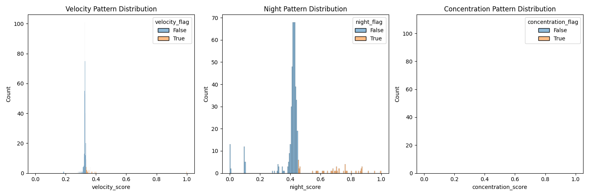
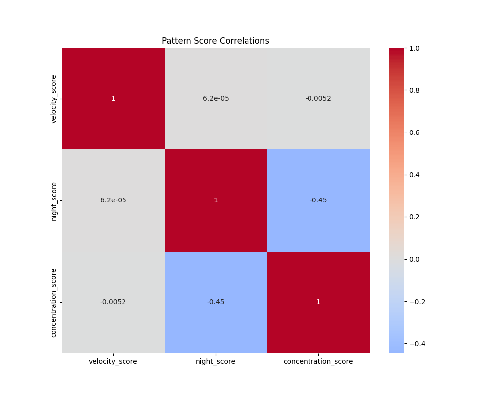

# Merchant Fraud Detection System

## Overview
The **Merchant Fraud Detection System** is designed to detect fraudulent merchant behavior using a hybrid approach that combines autoencoder-based anomaly detection with pattern-specific rules. The system identifies and analyzes three primary fraud patterns:

- **High Velocity Transactions**: Sudden spikes in transaction volume.
- **Late Night Activity**: Unusual transaction behavior during night hours, often involving higher amounts.
- **Customer Concentration**: A small group of customers dominating the transactions, indicating possible collusion or irregular behavior.

This system helps detect anomalies effectively, providing insights into merchant behaviors for fraud prevention.

---

## Features

### 1. **Data Generation**
Generates synthetic datasets for merchants and transactions, embedding known fraud patterns for system testing.

### 2. **Feature Engineering**
Calculates merchant-level features from transaction data:
- **Time-Based Patterns**: Metrics like night-time transaction ratios and business-hour activity.
- **Amount-Based Patterns**: Statistics like average, variance, and skewness in transaction amounts.
- **Customer Concentration**: Metrics to assess transaction distribution among customers, such as dominance ratios.

### 3. **Pattern Detection**
Combines:
- **Autoencoder Anomaly Detection**: Trained on normal behavior to detect deviations.
- **Pattern-Specific Scoring**: Direct evaluation of known fraud patterns.

---

## Installation

Install required dependencies:

```bash
pip install -r requirements.txt
```

---

## Usage

### **Step 1: Generate Synthetic Data**
Generate merchant and transaction datasets for testing:

```bash
python data_generation/generate.py
```

Outputs:
- Synthetic data files in the `data/` directory.

---

### **Step 2: Generate Features**
Process transaction data into merchant-level features:

```bash
python gen_features.py
```

Outputs:
- `data/merchant_features_normalized.csv`: Normalized feature dataset.

---

### **Step 3: Train the Model**
Train an autoencoder on normal merchant behavior to detect anomalies:

```bash
python model.py
```

Outputs:
- `data/autoencoder_model.pth`: Trained autoencoder model file.

---

### **Step 4: Detect Patterns**
Identify fraudulent patterns and generate reports:

```bash
python pattern.py
```

Outputs:
- `data/pattern_detection_results.csv`: Results of pattern-specific detection.
- `images/pattern_distributions.png`: Distribution plots of pattern scores.
- `images/pattern_correlations.png`: Heatmap of correlations between patterns.

---

### **Step 5: Run the Complete Pipeline**
Run all steps in a single command:

```bash
python main.py
```

---

## Output Files

- **Features and Results**:
  - `data/merchant_features_normalized.csv`: Normalized merchant features.
  - `data/pattern_detection_results.csv`: Fraud detection results.

- **Model**:
  - `data/autoencoder_model.pth`: Trained anomaly detection model.

- **Visualizations** (saved in the `images/` directory):
  - `images/pattern_distributions.png`: Distribution plots of pattern scores.
  - `images/pattern_correlations.png`: Correlation heatmap of fraud patterns.

---

## Testing

Run tests for synthetic data generation:

```bash
pytest data_generation/test_generated_data.py
```

---

## Performance Metrics

- **Detection Rates**:
  - Model-based anomaly detection rate.
  - Detection rates for individual fraud patterns.
  
- **False Positive Rates**:
  - Evaluate how often the system flags non-fraudulent behavior incorrectly.

- **Pattern Overlap Analysis**:
  - Understand the overlap between fraud patterns to refine detection strategies.

---

## Directory Structure

```
.
├── data/
│   ├── transactions.csv
│   ├── merchant_features_normalized.csv
│   ├── autoencoder_model.pth
│   ├── pattern_detection_results.csv
├── data_generation/
│   ├── generate.py
│   ├── test_generated_data.py
├── images/
│   ├── pattern_distributions.png
│   ├── pattern_correlations.png
│   ├── error_distribution.png
├── gen_features.py
├── model.py
├── pattern.py
├── main.py
├── requirements.txt
├── README.md
```

---

## Example Results

- **Fraud Pattern Distribution**:  
  

- **Pattern Correlation Heatmap**:  
  

This system enables a comprehensive view of fraudulent merchant behavior, combining statistical insights with machine learning for reliable detection.